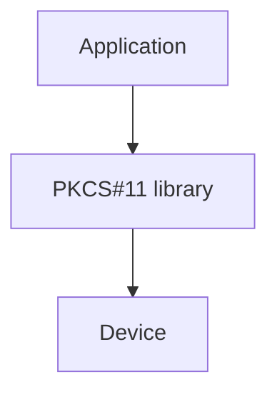
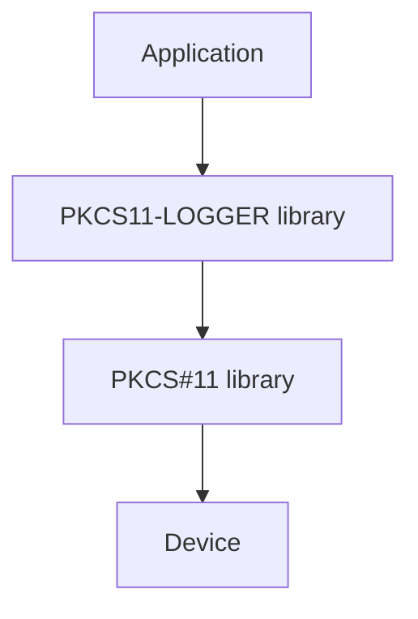

PKCS11-LOGGER
=============
**PKCS#11 logging proxy module**

[](https://github.com/Pkcs11Interop/pkcs11-logger/actions/workflows/windows.yml)
[](https://github.com/Pkcs11Interop/pkcs11-logger/actions/workflows/linux.yml)
[](https://github.com/Pkcs11Interop/pkcs11-logger/actions/workflows/macos.yml)

## Table of Contents

* [Overview](#overview)
* [Output example](#output-example)
* [Configuration](#configuration)
* [Download](#download)
* [Building the source](#building-the-source)
  * [Windows](#windows)
  * [Linux](#linux)
  * [macOS](#macos)
* [License](#license)
* [About](#about)

## Overview

PKCS11-LOGGER (hereafter referred to as logger) is a minimalistic C library that implements the [PKCS#11 v2.20](https://github.com/Pkcs11Interop/PKCS11-SPECS/tree/master/v2.20) API.

PKCS#11 is a cryptographic standard that defines an ANSI C API for accessing smart cards and other types of cryptographic hardware.

Library implementing the PKCS#11 interface is typically used in the following scenario:



Due to the complexity of the PKCS#11 API, users often need to troubleshoot communication issues between the application and the PKCS#11 library. This is where the logger becomes useful.

The logger acts as an intermediary between the application and the original PKCS#11 library:



When an application calls PKCS#11 function provided by the logger, the logger forwards the call to the original PKCS#11 library while logging the interaction. It then returns the result to the application.

## Output example

By default, each logged line starts with two hexadecimal numbers separated by a colon. The first number represents the process ID, and the second represents the thread ID. The following example shows a call to the `C_OpenSession` function:

```
0x0000956c : 0x0000000000006838 : 2025-02-12 06:28:22.171000 - Entered C_OpenSession
0x0000956c : 0x0000000000006838 : Input
0x0000956c : 0x0000000000006838 :  slotID: 1
0x0000956c : 0x0000000000006838 :  flags: 6
0x0000956c : 0x0000000000006838 :   CKF_RW_SESSION: TRUE
0x0000956c : 0x0000000000006838 :   CKF_SERIAL_SESSION: TRUE
0x0000956c : 0x0000000000006838 :  pApplication: 0000000000000000
0x0000956c : 0x0000000000006838 :  Notify: 0000000000000000
0x0000956c : 0x0000000000006838 :  phSession: 000000782AFFF110
0x0000956c : 0x0000000000006838 :  *phSession: 721416464
0x0000956c : 0x0000000000006838 : 2025-02-12 06:28:22.171000 - Calling C_OpenSession
0x0000956c : 0x0000000000006838 : 2025-02-12 06:28:22.171000 - Received response from C_OpenSession
0x0000956c : 0x0000000000006838 : Output
0x0000956c : 0x0000000000006838 :  phSession: 000000782AFFF110
0x0000956c : 0x0000000000006838 :  *phSession: 1
0x0000956c : 0x0000000000006838 : 2025-02-12 06:28:22.171000 - Returning 0 (CKR_OK)
```

## Configuration

The logger's behavior can be controlled using the following [environment variables](https://en.wikipedia.org/wiki/Environment_variable):

* **`PKCS11_LOGGER_LIBRARY_PATH`**

  Specifies the path to the original PKCS#11 library. The value must be provided without enclosing quotes. If this variable is not defined, all logger functions return `CKR_GENERAL_ERROR` and print an error message to `STDERR`.

* **`PKCS11_LOGGER_LOG_FILE_PATH`**

  Specifies the path to the log file. The value must be provided without enclosing quotes.

* **`PKCS11_LOGGER_FLAGS`**

  Specifies a [bitmask](https://en.wikipedia.org/wiki/Mask_(computing)) that controls multiple logger features. The meaning of individual bits is as follows:

  * `0x01` hex or `1` dec disables logging to the log file
  * `0x02` hex or `2` dec disables logging of the process ID
  * `0x04` hex or `4` dec disables logging of the thread ID
  * `0x08` hex or `8` dec enables logging of PINs
  * `0x10` hex or `16` dec enables logging to `STDOUT`
  * `0x20` hex or `32` dec enables logging to `STDERR`
  * `0x40` hex or `64` dec enables reopening of the log file (reduces performance but allows log file deletion)

  The value must be provided as a decimal number representing the sum of the desired features. For example, a value of `6` disables logging of both the process ID and thread ID. The default value is `0`.

## Download

Signed precompiled binaries as well as source code releases can be downloaded from [releases page](https://github.com/Pkcs11Interop/pkcs11-logger/releases).  
Archives with source code are signed with [GnuPG key of Jaroslav Imrich](https://www.jimrich.sk/crypto/).  
Windows libraries are signed with [code-signing certificate of Jaroslav Imrich](https://www.jimrich.sk/crypto/).

## Building the source

### Windows

Execute the build script on a 64-bit Windows machine with [Visual Studio 2022](https://visualstudio.microsoft.com/vs/) (or newer) installed:

```
cd build/windows/
build.bat
```
	
The script should use Visual Studio to build both 32-bit (`pkcs11-logger-x86.dll`) and 64-bit (`pkcs11-logger-x64.dll`) versions of the library.

### Linux

Execute the build script on a 64-bit Linux machine with GCC, GNU Make and GCC multilib support installed (available in [build-essential](https://packages.ubuntu.com/noble/build-essential) and [gcc-multilib](https://packages.ubuntu.com/noble/gcc-multilib) packages on Ubuntu 24.04 LTS):

```
cd build/linux/
sh build.sh
```

The script should use GCC to build both 32-bit (`pkcs11-logger-x86.so`) and 64-bit (`pkcs11-logger-x64.so`) versions of the library.

### macOS

Execute the build script on a 64-bit macOS machine with [Xcode](https://developer.apple.com/xcode/) and its "Command Line Tools" extension installed:

```
cd build/macos/
sh build.sh
```

The script should use Clang to build Mach-O universal binary (`pkcs11-logger.dylib`) usable on both Apple silicon and Intel-based Mac computers.

## License

PKCS11-LOGGER is available under the terms of the [Apache License, Version 2.0](https://www.apache.org/licenses/LICENSE-2.0).  
[Human friendly license summary](https://www.tldrlegal.com/license/apache-license-2-0-apache-2-0) is available at tldrlegal.com but the [full license text](LICENSE.md) always prevails.

## About

PKCS11-LOGGER has been written for the [Pkcs11Interop](https://www.pkcs11interop.net/) project by [Jaroslav Imrich](https://www.jimrich.sk/).  
Please visit project website - [pkcs11interop.net](https://www.pkcs11interop.net) - for more information.
